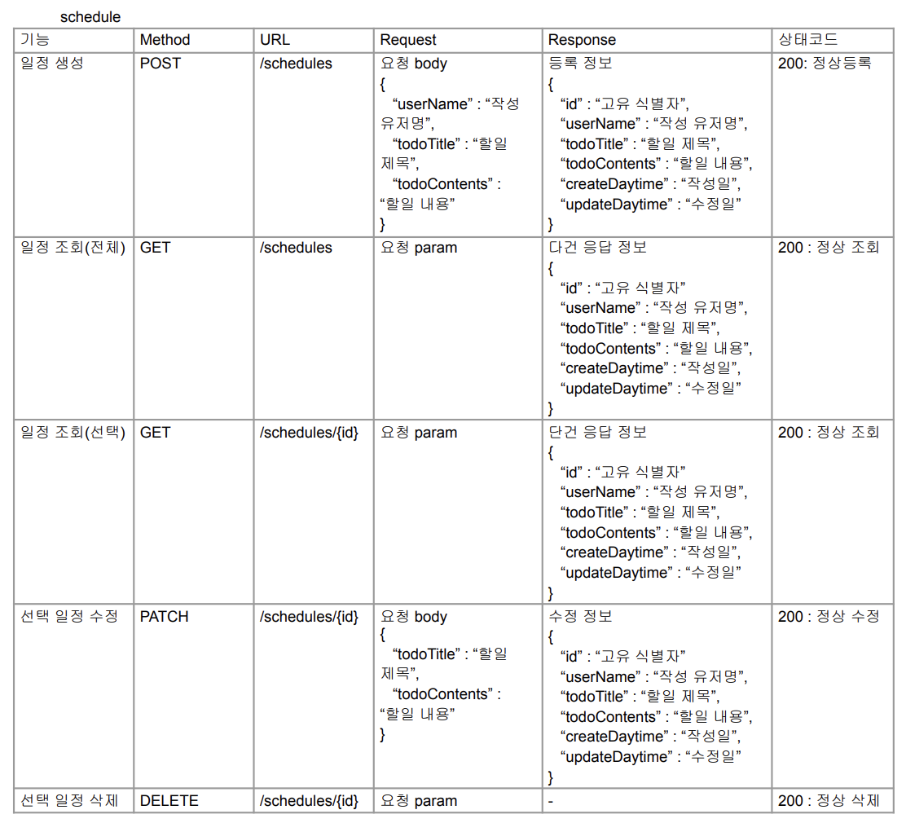
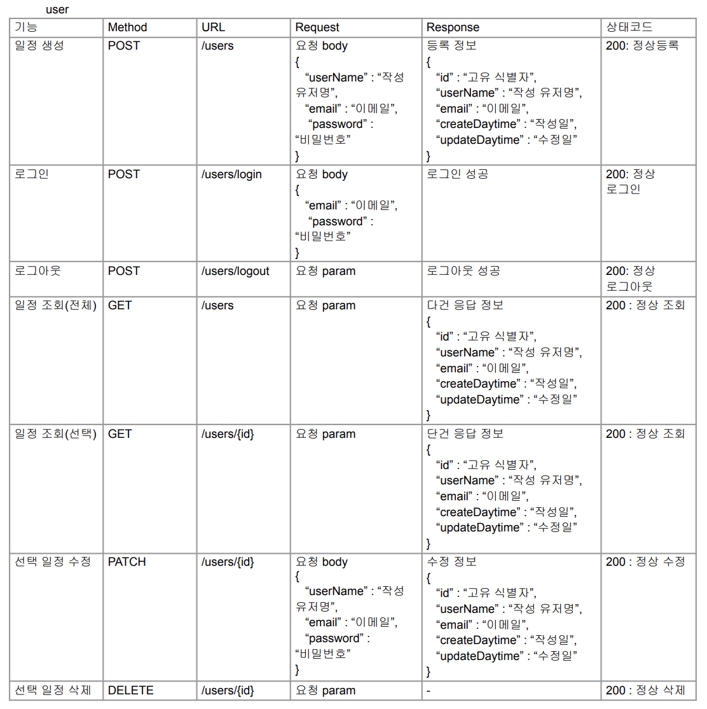
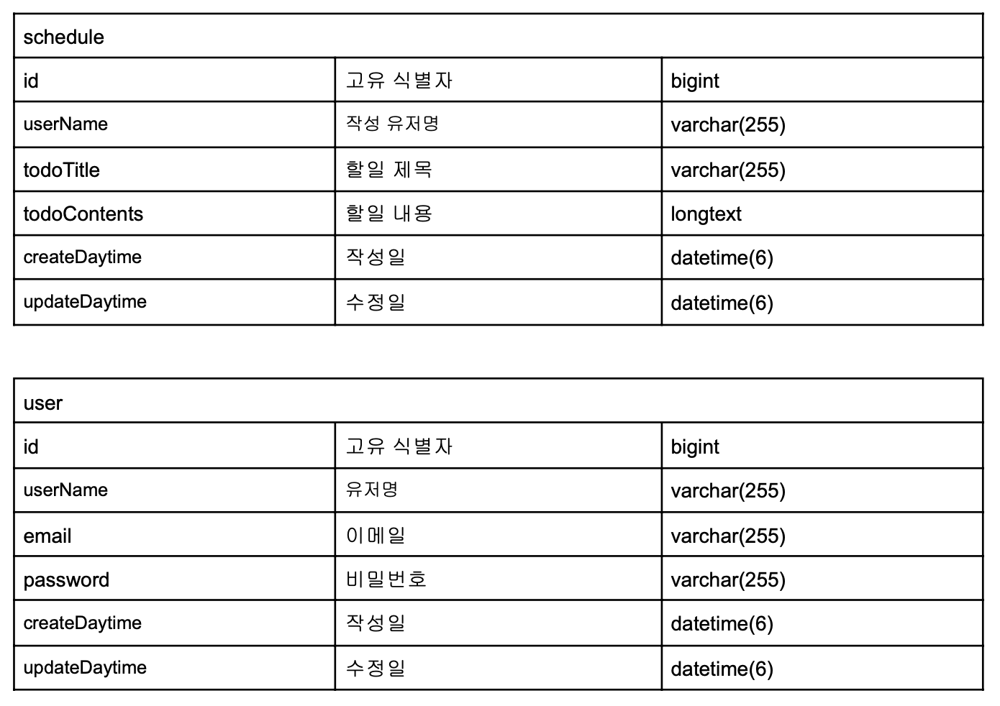

# boot_scheduler_ver2

## 개요
이 프로젝트는 일정관리 애플리케이션입니다. 
이 일정관리 애플리케이션은 회원가입 후 일정을 저장하고 조회하거나 수정 및 삭제를 할 수 있습니다.

## 개발기간
2025.3.26 ~ 2025.4.4

## 기능
- 회원가입 후  로그인하거나 로그아웃 할 수 있습니다.
- 일정을 생성하고 생성한 일정을 수정하거나 삭제할 수 있습니다.

## API 명세서

## ERD  

